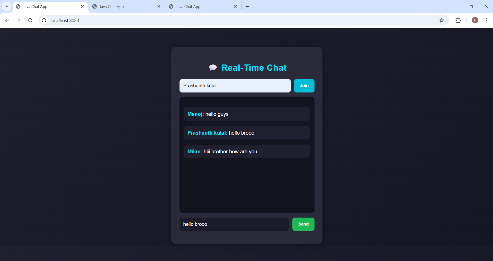
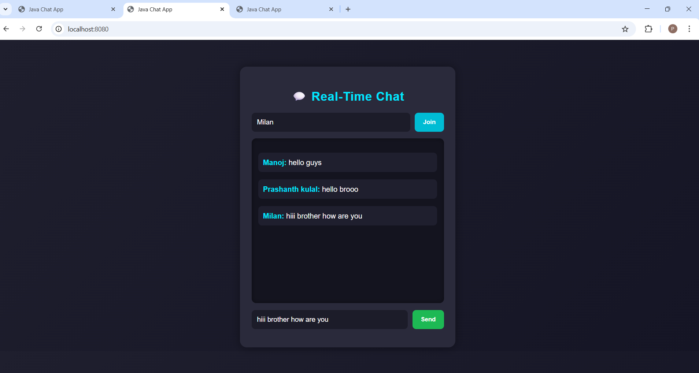

# 💬 Real-Time Chat Application (Spring Boot + WebSocket)

A simple and modern **real-time web-based chat application** built using **Java Spring Boot** and **WebSocket**.
This project demonstrates live messaging between users without refreshing the page.

---

## 🚀 Features

* ✅ Real-time communication using WebSocket
* ✅ Clean and simple UI (HTML, CSS, JavaScript)
* ✅ Spring Boot backend (Java 17)
* ✅ Lightweight — no database required
* ✅ Runs locally with minimal setup
* ✅ Maven-based project structure
* ✅ Beginner-friendly architecture

---

## 🛠️ Tech Stack

| Layer      | Technology Used            |
| ---------- | -------------------------- |
| Backend    | Spring Boot 3.x            |
| Language   | Java 17                    |
| Realtime   | WebSocket (STOMP Protocol) |
| Frontend   | HTML + CSS + JavaScript    |
| Build Tool | Maven                      |
| Server     | Embedded Tomcat            |

---

## 📂 Project Structure

```
demo/
 ├── src/
 │   ├── main/
 │   │   ├── java/com/chatapp/
 │   │   │   ├── config/            → WebSocket Configuration
 │   │   │   ├── controller/        → Chat Controller
 │   │   │   ├── model/             → Message Model
 │   │   │   └── DemoApplication.java
 │   │   └── resources/
 │   │       ├── static/
 │   │       │   ├── index.html     → Chat UI
 │   │       │   ├── style.css      → Styling
 │   │       │   └── app.js         → Frontend Logic
 │   │       └── application.properties
 │   └── test/ (Not used)
 ├── pom.xml
 └── mvnw / mvnw.cmd
```

---

## ⚙️ Prerequisites

Make sure you have installed:

* Java JDK 17+
* Maven (or use included Maven Wrapper)
* Git (optional)

---

## ▶️ How to Run the Project

### Step 1 — Clone the Repository

```
git clone <your-repo-url>
cd demo
```

---

### Step 2 — Build the Project (Skip Tests)

```
mvn clean install -DskipTests
```

---

### Step 3 — Run the Application

```
mvn spring-boot:run
```

---

### Step 4 — Open in Browser

```
http://localhost:8080
```

🎉 Now open the link in multiple tabs to test real-time chat!

---

## 🔌 How It Works

1. Frontend connects to WebSocket endpoint:

```
/ws
```

2. Messages are sent to:

```
/app/chat
```

3. Spring broadcasts messages to:

```
/topic/messages
```

4. All connected clients receive messages instantly.

---

## 📸 Demo

Open the app in two browser tabs and start chatting in real-time.

---

## 📸 Screenshots

### Person1


### Person2


### person3



## 📦 Future Improvements

* Add user authentication
* Store messages in database (MySQL / MongoDB)
* Add chat rooms
* Deploy to cloud (AWS / Render / Railway)
* Add emoji support 😊

---

## 👨‍💻 Author

Developed as a learning project to understand:

* Spring Boot Architecture
* WebSocket Communication
* Full-stack Java Web Development

---

## 📜 License

This project is open-source and free to use for educational purposes.
